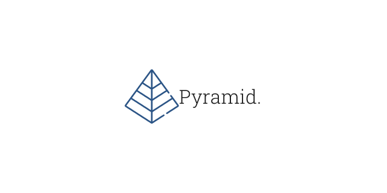

## `task` Pyramid

### Description

I should:

- Display pyramid in browser
- Display numbers in order in the cells of the pyramid
- Highlight prime numbers

#### 🕜 Time

Development: 2,5 hours

#### ✏️ Links

See work [here]()
